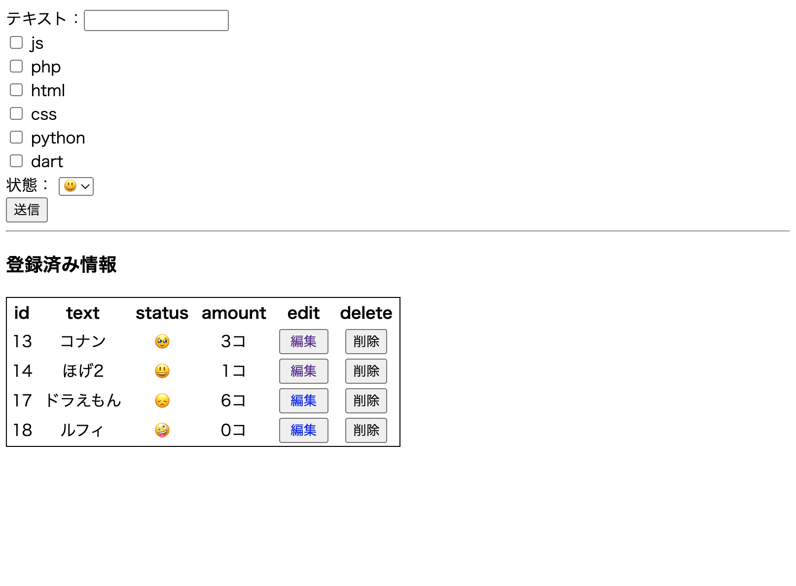

# checkbox_selectbox_data_crud

check box,select boxを含んだ内容のCRUD
https://github.com/TatsuyaMaeta/checkbox_selectbox_data_crud/tree/bc2cb10eff75df7601324bffbf72e4a9eb17baa6

### top画像(index.php)　v2

select boxの部分を全てチェックを入れたら色が変わるようなcssを追加しました

### top画像(index.php)　v1

